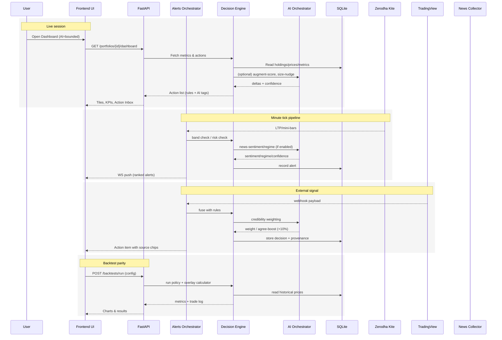
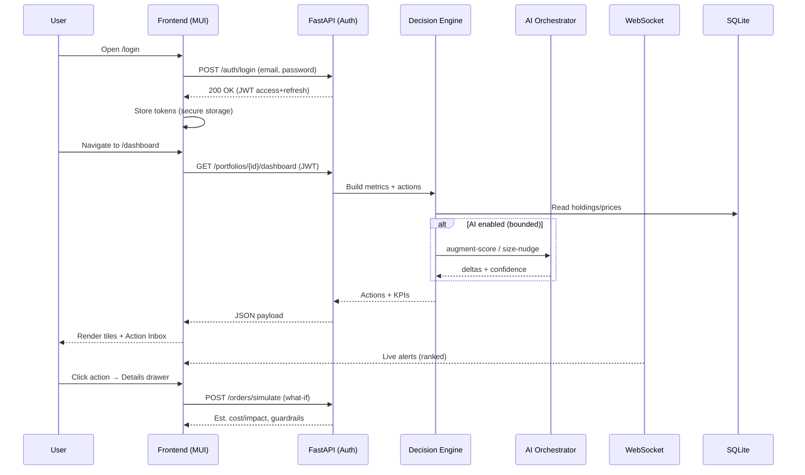

# ArthaSutra — Project Requirements Document (PRD)

**Audience:** Founder–builder (you), future collaborators

**Market:** India (NSE/BSE cash equity to start). Optional later: ETFs, MFs, F\&O.

**Tech Stack (proposed):**

* **Frontend:** React + **Material UI**, Vite, Zustand/Redux Toolkit for state, Recharts/ECharts for charts
* **Backend:** **Python + FastAPI**, Pydantic v2, SQLAlchemy/SQLModel, **SQLite** (start), APScheduler for jobs, WebSocket (uvicorn) for live alerts
* **Engines/Libraries:** pandas, numpy, **PyPortfolioOpt**, vectorbt/backtrader (backtests), ta/TA-Lib (indicators), statsmodels (factors), **Optuna** (safe auto‑tuning), loguru (logging)
* **Broker/Market Data (India):** Zerodha **Kite Connect** (REST + WebSocket). Start with EOD + minute bars; live quotes for watch/portfolio
* **Testing:** **pytest** as the primary framework for all modules, engines, and features
* **Parallelization:** Use **concurrent.futures**, **multiprocessing**, or higher-level frameworks like **Ray/Dask** where appropriate to enhance performance

---

## 1) Problem Statement & Goals

Your current portfolio is ad‑hoc, built without consistent rules. You want a **web app** that:

1. Turns holdings into a **rules‑driven**, **risk‑aware**, **tax‑sensible** system.
2. Produces **actionable decisions** (Keep / Add / Trim / Exit) with quantities, prices, and reasons.
3. **Backtests** policies and **learns** over time from predicted vs actual outcomes.
4. Works with **Indian markets** and integrates with **Zerodha** for live metrics/alerts.
5. Executes **buy/sell orders** via Zerodha Kite API (not just read-only).

### Success (what “good” looks like)

* Clear **Action Inbox** with quantified trades and risk checks.
* **Backtest → Deploy parity**: the policy you see in Backtest Lab behaves the same live.
* **Risk managed**: max position/sector caps, per‑trade risk, bounded drawdowns.
* **Explainable**: every action carries the “why”.
* **Low friction**: CSV import, multi‑portfolio CRUD, single‑file config for knobs.
* **Executable**: ability to trigger orders directly to broker.


---

## 2) Core Concept

**Core & Overlay**

* **Core**: long‑term holdings + annual (or band) rebalancing.
* **Overlay**: tactical trims/add‑backs (e.g., **+8% → sell 20%**, **−3% → buy back 20%**) designed to harvest swings yet keep **net units stable** over a rolling period (e.g., 30 BSE shares net over a month). Restoration is **flexible** (staggered/opportunistic) rather than strict, with potential **aggression levels** (week, month, quarter, target\_price).

**Learning Loop**

* Track hit‑rate, avg win/loss, slippage, tax drag. Nudge thresholds (e.g., TP1 %, ATR multipliers) safely via **Optuna** within bounds.

---

## 3) MVP Scope

**User Management**

* Secure **User Login/Authentication** (JWT-based). Password hashing, session mgmt.
* Roles: **User** (portfolio owner) and **Admin** (platform settings).
* **Admin Dashboard**: control tunable defaults (risk caps, overlay aggression, AI influence modes), manage benchmarks, enable/disable integrations.

**Must‑have**

1. **Multi‑Portfolio CRUD** (SQLite): create, update, delete; per‑portfolio settings.
2. **CSV Import** for holdings & cash. Portfolio snapshot baseline.
3. **Market Data**: EOD (historical), minute bars; live LTP via Zerodha (subset).
4. **Analytics & Risk**: PnL, returns (CAGR, rolling), volatility, Sharpe/Sortino, MaxDD, exposure by sector/factor; concentration checks.
5. **Decision Engine v1**: Q/T/V composite score + rules → **Action Inbox** with qty, stops, limits.
6. **Overlay Engine v1**: percent/ATR bands with **net‑units stabilizer**.
7. **Rebalance Proposals**: annual + drift band (±5 p.p.) with tax‑aware lot suggestions.
8. **Backtest Lab**: run policy + overlay on historical data; show metrics & trade log.
9. **Alerts**: price/ATR band hits, earnings events (manual list to start), band breach, risk limit warnings; WebSocket push.
10. **Config‑driven**: a single `config.yaml` per portfolio with all knobs.

**Nice‑to‑have (MVP+)**

* Paper‑trading journal; HIFO/LIFO lot selection; simple factor regression; Monte Carlo on withdrawals.

---

## 4) Non‑Goals (initially)

* Derivatives, shorting, leverage, smart order routing. But **broker write‑access (place orders)** is **in-scope** now.

---

## 5) Domain Model (SQLite)

**Tables (minimum viable):**

* `portfolios` (id, name, base\_ccy, tz, created\_at)
* `securities` (id, symbol, exchange, name, sector, lot\_size, tick\_size)
* `holdings` (id, portfolio\_id, security\_id, qty\_total, avg\_price)
* `lots` (id, holding\_id, qty, price, date, account, tax\_status)
* `benchmarks` (id, code, description)
* `prices_eod` (security\_id, date, ohlc, volume)
* `prices_intraday` (security\_id, ts, ohlc, volume)
* `signals` (id, portfolio\_id, security\_id, date, q, t, v, score, reason)
* `orders` (id, side, qty, limit, stop, tif, status, reason, created\_at)
* `trades` (id, order\_id, fill\_qty, fill\_px, fee, tax, lot\_links)
* `metrics_daily` (portfolio\_id, date, cagr, sharpe, sortino, maxdd, exposure\_json)
* `alerts` (id, portfolio\_id, type, security\_id, rule\_id, payload\_json, status)
* `configs` (portfolio\_id, yaml\_text, updated\_at)

Indexes on `(security_id, date)` for prices; `(portfolio_id, security_id)` for holdings/signals.

---

## 6) Configuration (per‑portfolio) — `config.yaml`

```yaml
portfolio:
  name: "Core India"
  base_ccy: "INR"
  timezone: "Asia/Kolkata"

data:
  provider: "kite"
  symbols: ["NSE:BSE", "NSE:HDFCBANK", "NSE:RELIANCE"]
  refresh_seconds: 60            # live LTP/mini-bars cadence; configurable up to 3600s (60m)

risk:
  max_risk_per_trade_pct: 0.75   # of equity, tuned for Indian equities
  capital_per_trade_cap_pct: 5
  max_position_pct: 12
  max_sector_pct: 35
  slippage_bps: 10
  fees_model: "zerodha_default"  # pluggable broker fee calc

policy:
  rebalance: { type: "annual_band", band_pp: 5 }
  composite_weights: { Q: 0.4, T: 0.4, V: 0.2 }
  min_liquidity_avg_turnover_inr: 1_000_000

overlay:
  enabled: true
  anchor: { type: "manual", value: 2700 }  # or vwap/rolling
  tp1_percent: 8          # +8% → trim 20%
  tp1_trim_pct: 20
  buyback_percent: -3     # −3% from last trim → add 20%
  buyback_add_pct: 20
  atr_mult_stop: 2.0
  atr_mult_tp: 2.5
  net_units_target: 30
  net_units_window_days: 30
  restoration: "flexible"   # opportunistic; can define aggression levels (week, month, quarter, target_price)

alerts:
  earnings_watch: ["NSE:INFY", "NSE:TCS"]
  rules: ["price_move", "atr_band", "rebalance_band", "risk_limit"]
```

---

## 7) Backend API (FastAPI)

**REST**

* `POST /portfolios` — create
* `GET /portfolios` | `/portfolios/{id}` — list/read
* `POST /portfolios/{id}/import-csv` — seed holdings/lots
* `GET /portfolios/{id}/dashboard` — summary metrics (CAGR, Sharpe, DD, exposures)
* `GET /portfolios/{id}/positions` — per‑stock tiles (`pct_today`, `pnl_inr`, `score`)
* `POST /portfolios/{id}/rebalance/propose` — drift fix proposal
* `POST /portfolios/{id}/overlay/simulate` — simulate overlay rules
* `POST /backtests/run` — run policy + overlay; body: date range, policy cfg
* `GET /alerts` | `POST /alerts/ack` — outstanding alerts + ack
* `GET /quotes?symbols=...` — live quotes (Kite wrapper)
* `POST /orders/place` — place buy/sell order via Zerodha Kite
* `POST /orders/cancel` — cancel order
* `GET /orders/status/{id}` — track order status


**WebSocket**

* `/ws/alerts` — push band hits, risk breaches, earnings reminders

**Services/Workers**

* Price collector (Kite REST/WebSocket → SQLite)
* Daily close pipeline (EOD metrics, signals)
* Minute pipeline (overlay checks, intraday alerts); cache **1 day** of minute data locally for speed, fallback to Kite/Yahoo if missing

---

## 8) Frontend (React + Material UI)

* **Pages:** Dashboard, Portfolio Detail, Position Detail, Backtest Lab, Alerts, Settings
* **Components:** Action Inbox, Health KPIs, Factor/Sector blocks, Position tile ("+2.4% / ₹1,240"), Overlay controls, Trade Log, Config Editor (YAML), CSV Importer
* **Charts:** Line (equity curve), Bar (attribution), Heatmap (sector/weight), Scatter (factor exposure), Candles + ATR bands for position detail

---

## 9) Decision Engine v1 (explainable)

* **Composite Score:** `0.4*Q + 0.4*T + 0.2*V`
* **Rules → Actions:**

  * EXIT: `score<40 && <200DMA && EPS_rev_neg` or stop hit
  * TRIM: overweight vs target by >x% or extended vs 50DMA with momentum fading
  * ADD: score>70, underweight, budget ok, liquidity ok
  * KEEP: otherwise
* **Sizing:** Qty = `risk_budget / stop_distance(ATR)` bounded by capital & max\_position%
* **Overlay:** tp1/buyback with net‑units stabilizer (flexible restoration)

---

## 10) Backtest Lab

* **Inputs:** portfolio snapshot (CSV), date range, policy config, overlay config
* **Outputs:** CAGR, Sharpe/Sortino, MaxDD, turnover, overlay P\&L, trade log, attribution (allocation/selection/overlay vs fees/taxes)
* **Parity**: same calculator used in live engine (no duplicate logic)

---

## 11) Security & Secrets

* Kite API keys in `.env`/backend secrets (never in client). Role: read‑only at first.
* CORS locked to your domain (configurable). Rate limits on public endpoints.

---

## 12) Observability

* **Logging:** loguru, structured JSON for pipelines; request ID correlation
* **Metrics:** Prom-style counters (jobs run, alerts fired), optional Grafana later

---

## 13) Acceptance Criteria (selected)

### A1 – Overlay Profit Harvest (BSE)

**Given** portfolio holds 30 units BSE @ anchor 2700; overlay enabled (`tp1=+8%`, `trim=20%`, `buyback=-3%`, `add=20%`, `restoration=flexible`).
**When** LTP reaches ≥ 2916 (≈+8%).
**Then** Action Inbox shows `SELL 6 (20%) @ limit 2916` with reason `TP1 reached`.
**And** a contingent buyback order suggestion at `~2829` (−3% from sell).
**And** after buyback(s) are executed, **net units** = 30 within the window, via opportunistic staggered buys.

### A2 – Annual Rebalance with Bands

**Given** portfolio small‑cap bucket exceeds target by >5 p.p.
**When** user opens Rebalance.
**Then** app proposes sells/buys to restore to targets (tax‑aware lots first), with impact estimates.

### A3 – Live Tiles

**Given** live data stream is active.
**Then** each position tile shows **`+X% / ₹Y`** intraday and updates at the configured cadence (default 60s; configurable up to 60m); no UI hitches.

### A4 – Backtest Parity

**Given** a policy config run in Backtest Lab.
**Then** deploying the same config live uses the same calculator; unit tests assert parity on synthetic paths.

---

## 14) Test Plan (high level)

* **Unit:** fee model, ATR calc, sizing, composite score, overlay triggers, lot accounting
* **Property tests:** net‑units stabilizer never drifts beyond tolerance over window
* **Integration:** CSV import → analytics → action inbox; backtest vs live parity
* **E2E smoke:** create portfolio → import CSV → view dashboard → run backtest → see actions
* **Broker execution tests:** mock Kite API to validate order placement, modification, and cancellation flows
* **Coverage goal:** ≥70% overall, ≥85% for critical paths (execution, risk, decision engines)

---

## 15) Roadmap (sequence)

1. Data layer + CSV import + basic dashboard
2. EOD analytics (KPIs) + Action Inbox (rules v1)
3. Overlay engine + alerts (WebSocket)
4. Backtest Lab (policy + overlay) + parity harness
5. Zerodha live quotes integration (read‑only)
6. Rebalance proposals + lot‑aware tax estimates
7. Auto‑tuning (Optuna) with guardrails

---

## 16) Open Questions (for your sign‑off)

* \[Resolved] **UI kit:** Material UI
* \[Resolved] **Overlay restoration:** Flexible, opportunistic with aggression levels
* \[Resolved] **Update cadence:** Default 60s, configurable (up to 60m)
* \[Resolved] **Risk defaults:** Keep, tuned for Indian equities
* \[Resolved] **Benchmarks:** Default NIFTY 50, provision for multi/single blended benchmarks
* \[Resolved] **Fees/taxes:** Zerodha default template
* \[Resolved] **Minute data retention:** Cache 1 day locally; fallback to Kite/Yahoo

Future scope remains: add SIP flows, MF/ETF support, broker write APIs.

---

## 17) Appendix — Sample CSV (import)

```csv
symbol,exchange,qty,avg_price,sector
BSE,NSE,30,2700,Financial Services
HDFCBANK,NSE,120,1520,Banks
RELIANCE,NSE,25,2900,Energy
```

## 18) Appendix — Example API Response (tiles)

```json
{
  "positions": [
    {"symbol": "NSE:BSE", "ltp": 2845, "pct_today": 2.4, "pnl_inr": 1240, "score": 68},
    {"symbol": "NSE:HDFCBANK", "ltp": 1545, "pct_today": -0.3, "pnl_inr": -420, "score": 82}
  ]
}
```

---

## 19) AI Extensions & Synergy

* **Influence Mode:** Default **bounded**; advisory/full available as config.
* **Sources:** Start with official news + exchange announcements; add social later.
* **TradingView Fusion:** When TradingView & rules agree, apply +10% boost (within caps).
* **Noise Tolerance:** Minimum confidence threshold = 0.6 (tunable).
* **Explainability:** Inline clutter avoided; link to drill‑down news/sentiment panel.
* **Use Cases:**

  * Augment Q/T/V with AI (Q/T/V/A composite).
  * Natural‑language analytics ("Why underperform?").
  * News/sentiment‑aware alerts & ranking.
  * Adaptive regime detection and overlay tuning.
  * TradingView signal weighting & credibility scoring.
* **Guardrails:** Max deltas bounded, never exceed risk caps, all AI adjustments logged.

---

## 20) TBD / Suggestive Features

* Social sentiment integration (Twitter, Reddit).
* Factor regime rotation (value/growth/momentum cycles).
* Multi‑broker support (Fyers, AngelOne).
* SIP flows, MF/ETF onboarding.
* Options/F\&O overlay strategies (future).
* Cloud deployment templates (AWS/GCP/Azure).

---

## 21) Outstanding Queries & Evolution Points

* **Visual explainability**: How should drill‑down panels look (cards, modals, sidebars)?
* **Portfolio goals**: Should long‑term goals (retirement corpus, child education) be explicit in config?
* **Data sources**: Any premium data/news APIs worth licensing, beyond free feeds?
* **Expansion cadence**: Should we prioritize multi‑broker next, or advanced analytics (factor rotation, ML)?
* **AI training**: Do we want to log all user actions to fine‑tune AI later (personalized)?

---

## 22) System Architecture Diagram

```mermaid
flowchart TB
  subgraph Client[Frontend: React + Material UI]
    UI[Pages: Dashboard / Portfolio / Position / Backtest / Alerts / Settings]
    WS[WebSocket Client]
    CFG[Config Editor (YAML)]
  end

  subgraph API[Backend: FastAPI]
    GW[REST API Gateway]
    WSS[WebSocket Server]
    SVC_CORE[Decision Engine & Risk]
    SVC_OVERLAY[Overlay Engine]
    SVC_BT[Backtest Engine]
    SVC_ALERTS[Alerts Orchestrator]
    SVC_AI[AI Orchestrator]
  end

  subgraph DATA[Storage]
    DB[(SQLite)]
    FS[(Feature Store: parquet/SQLite)]
  end

  subgraph MARKET[External Feeds]
    KITE[Zerodha Kite REST/WebSocket]
    NEWS[News/Exchange Announcements]
    TV[TradingView Webhook]
  end

  UI <--> GW
  WS <--> WSS

  GW --> SVC_CORE
  GW --> SVC_OVERLAY
  GW --> SVC_BT
  GW --> SVC_ALERTS
  GW --> SVC_AI

  SVC_CORE <--> DB
  SVC_OVERLAY <--> DB
  SVC_ALERTS <--> DB
  SVC_BT <--> DB
  SVC_AI <--> FS
  SVC_CORE <--> FS

  SVC_ALERTS <-- push -- WSS

  KITE --> SVC_ALERTS
  KITE --> SVC_CORE
  KITE --> SVC_OVERLAY
  KITE --> DB

  NEWS --> SVC_AI
  TV --> SVC_ALERTS
  TV --> SVC_CORE
```

---

## 23) Data Flow Diagram (E2E)



---

## 24) UI Blueprint (Final Look & Key Screens)

**Theme**: Material UI, light mode (primary #1976d2), compact density, numeric fonts (tabular numerals).

### 24.1 Dashboard

* **Header bar**: Portfolio switcher · Date range · **AI toggle** (Off/Advisory/Bounded/Full) with colored badge.
* **KPIs row**: CAGR, Sharpe/Sortino, MaxDD, Drawdown sparkline, Fees+Taxes TTM.
* **Action Inbox** (cards/table):

  * Columns: Action · Symbol · Price · Score(Q/T/V/A) · Reason · Qty/Size · Order (Limit/SL) · **Source chips** (Rules / AI / TradingView) · \[Details]
  * Row click → **Decision Drawer**: shows *Baseline vs AI‑influenced* recommendation diff, guardrails, and link to **News Drill‑down**.
* **Exposure & Risk**: Sector bars, factor tilts, top concentration list.
* **Alerts panel**: Live WS feed, ranked by impact; “Snooze/ACK” buttons.

### 24.2 Position Detail (e.g., NSE\:BSE)

* **Price chart**: Candles + ATR bands + executed overlay trims/add‑backs.
* **Position tiles**: Core units, Overlay units (now), Anchor price, LTP, P\&L, risk (ATR, stop, impact est.).
* **Overlay controls**: tp1%, buyback%, ATR multipliers; **AI notes** if AI suggests aggression change (bounded).
* **Orders**: Suggested limit/stop grid with estimated fees/taxes.
* **News Drill‑down**: sentiment timeline, headlines, tags (earnings, policy, mgmt), confidence bars.

### 24.3 Backtest Lab

* **Config panel**: Policy (annual+band), Overlay (tp/buyback/ATR), Risk caps, Universe.
* **Run results**: Equity curve, drawdown chart, metrics grid, turnover, attribution (allocation/selection/overlay vs costs).
* **Parity switch**: “Show baseline vs AI‑enabled (bounded)” → overlay second line on charts.
* **Trade log**: sortable table with reasons and source chips.

### 24.4 Alerts

* **Feed**: Grouped by symbol; filters: price/ATR/news/TV.
* **Ranking**: Impact score (combines move × position size × sentiment × proximity to action).
* **Bulk actions**: ACK/Snooze, generate “what‑if” orders.

### 24.5 Settings

* **Config Editor**: YAML with validation; presets for risk/aggression.
* **Benchmarks**: Single and blended sets; compare Portfolio vs \[x1, x2,…] or \[(w,x1), (w,x2)…].
* **Integrations**: Zerodha keys, TradingView webhook URL, news sources.
* **Data**: CSV import/export; cache retention (1 day default).

### Micro‑interactions

* Hover tooltips show calculation definitions.
* Number roll‑ups animate on updates.
* WS reconnect indicator.

**Deliverables**: We can export these wireframes to Figma if you’d like high‑fidelity visuals next.

---

## 25) UI Theme & Design Tokens

To ensure consistency and ease of future theming, ArthaSutra will adopt a Material UI theme with explicit tokens:

```js
const theme = createTheme({
  palette: {
    mode: 'light',
    primary: { main: '#1976d2' },
    secondary: { main: '#9c27b0' },
    error: { main: '#d32f2f' },
    warning: { main: '#ed6c02' },
    success: { main: '#2e7d32' },
    info: { main: '#0288d1' }
  },
  typography: {
    fontFamily: 'Roboto, Helvetica, Arial, sans-serif',
    fontSize: 13,
    h1: { fontWeight: 500, fontSize: '2.25rem' },
    h2: { fontWeight: 500, fontSize: '1.75rem' },
    h3: { fontWeight: 500, fontSize: '1.5rem' },
    body1: { fontSize: '0.9rem' },
    button: { textTransform: 'none', fontWeight: 500 }
  },
  spacing: 8,
  shape: { borderRadius: 8 },
  components: {
    MuiButton: {
      styleOverrides: { root: { borderRadius: 8, padding: '6px 16px' } }
    },
    MuiCard: {
      styleOverrides: { root: { borderRadius: 12, boxShadow: '0 2px 8px rgba(0,0,0,0.08)' } }
    }
  }
});
```

**Color tokens:**

* Primary: `#1976d2` (blue) → headers, action buttons
* Secondary: `#9c27b0` (purple) → highlights, toggles
* Success: `#2e7d32` (green) → positive P\&L
* Error: `#d32f2f` (red) → negative P\&L, risk breaches
* Warning: `#ed6c02` (orange) → alerts pending
* Info: `#0288d1` (teal) → tooltips, info chips

**Spacing & Layout:** 8‑point grid; compact density to fit rich data. Cards use 12px radius, light shadows.

**Typography:** Roboto, tabular numerals enabled for portfolio tiles. Animations for roll‑up metrics.

---

## 26) Next Visual Steps

* Export wireframes to **Figma** using this theme.
* Define **component library** (ActionInboxCard, KPIBlock, PositionTile, ConfigEditorPane) mapped to Material UI primitives.
* Prepare **dark mode variant** with adjusted palette (primary #90caf9, background #121212).
* Create **responsive layouts** for tablet/desktop (mobile optional later).

This locks the design tokens so front‑end work can begin without ambiguity.

---

## 27) Sample UI Mockups (Concept)

### 27.0 Authentication & Admin

* **Login/Signup Screen:** Modern, centered card layout with ArthaSutra logo, email/password fields, and login button. Option to sign up. Material UI form validation. JWT tokens handled by backend.
* **Admin Dashboard:** Separate route accessible by Admin role. Sidebar with sections: Risk Defaults, Overlay Aggression, AI Influence Modes, Benchmarks, Integrations. Each presented as configurable cards with toggles/sliders. Audit log panel to track changes.

### 27.1 Dashboard (High‑Fidelity Mockup — Figma style)

* **Header bar:** Blue primary, left: logo + “ArthaSutra” title, center: portfolio dropdown + date picker, right: AI toggle (pill switch with OFF/Advisory/Bounded/Full).
* **Top KPIs row:** 5 cards (CAGR, Sharpe, MaxDD, Fees/Taxes TTM, Exposure %). Each card: numeric with animated counter, sparkline.
* **Action Inbox table:** Striped rows, columns: Action | Symbol | LTP | Score (Q/T/V/A stacked bar) | Qty | Reason | Source chips (colored tags) | \[Details]. AI‑influenced actions show subtle glow.
* **Alerts panel (right sidebar):** Collapsible, live feed with impact score and ACK/Snooze buttons.

### 27.2 Position Detail

* **Main chart:** Candle + ATR bands; overlay trims (red markers) and add‑backs (green markers).
* **Side tiles:** Core Units, Overlay Units, LTP, P\&L, Risk metrics. Each tile color‑coded.
* **Orders panel:** Grid of suggested limit/stop orders with estimated costs.
* **News Drill‑down panel:** Slide‑out with timeline of sentiment (color‑coded bars), clickable headlines, source attribution.

### 27.3 Backtest Lab

* **Config left pane:** Accordion for policy, overlay, risk settings (editable forms with sliders).
* **Main view:** Equity curve line chart; Drawdown area chart; Metrics grid; Attribution stacked bars.
* **Parity toggle:** Switch baseline vs AI overlay curve.
* **Trade log table:** Timestamped entries with action, qty, rationale, source chips.

### 27.4 Alerts Page

* **Feed:** Card list grouped by symbol. Each card shows alert type, confidence, impact score bar.
* **Controls:** Filters (type, source, confidence) on left. Bulk ACK/Snooze at top.

### 27.5 Settings Page

* **Tabbed layout:** General | Risk | Overlay | Benchmarks | Integrations | Data.
* **Config editor:** YAML editor with syntax highlighting + schema validation.
* **Integrations:** Cards for Zerodha, TradingView, News feeds (with connect/test buttons).

---

**Note:** These mockups can be directly translated into Figma frames with Material UI components, the defined design tokens (Section 25), and responsive auto‑layout.

---

## 28) Role‑Based User Flows (User vs Admin)

### 28.1 User Flow — Auth → Dashboard → Action



**Notes:**

* If `ai.enabled=false`, the call to **AI Orchestrator** is skipped and UI labels actions as **Source: Rules**.
* Decision drawer always shows **Baseline vs AI‑influenced** diff when AI is on.

### 28.2 Admin Flow — Change Defaults → Propagate → Audit

```mermaid
sequenceDiagram
  participant A as Admin
  participant UI as Admin UI
  participant API as FastAPI
  participant CFG as Config Service
  participant DE as Decision Engine
  participant WS as WebSocket
  participant DB as SQLite (configs + audit)

  A->>UI: Open /admin
  UI->>API: GET /admin/summary (JWT with role=admin)
  API-->>UI: Current defaults, integrations, audit log
  A->>UI: Update risk defaults (e.g., max_position_pct 12→10)
  UI->>API: PUT /admin/risk-defaults {10}
  API->>CFG: Validate + persist
  CFG->>DB: Write config + audit entry
  CFG-->>API: OK + version id
  API-->>UI: Save success toast
  API-->>WS: Broadcast config-changed event
  WS-->>DE: Invalidate caches / reload caps
  DE->>DB: Recompute breaches; enqueue alerts if any
  UI-->>A: Show effect preview (pos over caps, impacted actions)
```

**Admin Controls (high‑level):**

* Risk defaults, overlay aggression presets, AI influence modes (off/advisory/bounded/full)
* Benchmarks (single/blended) library
* Integrations (Zerodha, TradingView, News) — connect/test/disable
* User management (optional later): invite, role change, deactivate
* Audit log: who changed what, when, old→new values

**Access Control:**

* JWT with role claim (`user`, `admin`)
* Route guards client‑side; server enforces RBAC on each endpoint
* All admin mutations are audited with versioning & rollback option

---
## 31) Phased Delivery Plan (for Codex)

Update highlights:

* **Phase 3 — Overlay & Backtest**: keep
* **Phase 4 — Live Data & Integrations**: extend to include order routing mocks
* **Phase 5 — AI Co‑Driver (Bounded)**: keep
* **Phase 6 — Admin Console & Benchmarks**: keep
* **Phase 7 — Broker Order Execution**: implement full buy/sell order flows via Kite API, add pytest‑based integration tests, concurrency optimization for pipelines
* **Phase 8 — Hardening & UX Polish**: parallelization optimizations with Ray/Dask; further test automation

---

## 32) Module Priority & Dependencies

* Add: **Order Manager** module depends on **Decision Engine** and **Broker Integration**.
* Order Manager integrates with **Risk Engine** before sending orders to broker.

---

## 35) Definition of Done & Acceptance Gates

* **Unit coverage** ≥ 70% for engines; critical paths ≥ 85%.
* **Broker execution tests** passing with mocks.
* **Parallelization framework** in place for heavy pipelines (backtests, simulations).
* **Docs**: include instructions for test suite (`pytest` usage, fixtures, mocks).

---

## 36) API Addenda (Auth & Admin)

Unchanged.

---

## 37) Execution Engine Addendum

* **Order Manager**: core service that prepares, validates, and submits orders.
* **Flow:** Action Inbox → Risk Engine check → Order Manager → Zerodha Kite → Confirmation → Trade Log.
* **Concurrency**: order placement and data refresh pipelines run in parallel using async workers or Ray/Dask.
* **Testing**: pytest mocks for Kite API; stress tests for concurrent orders.

---

This update integrates **pytest testing mandate**, **parallelization framework adoption**, and **direct broker order execution** into the PRD.

